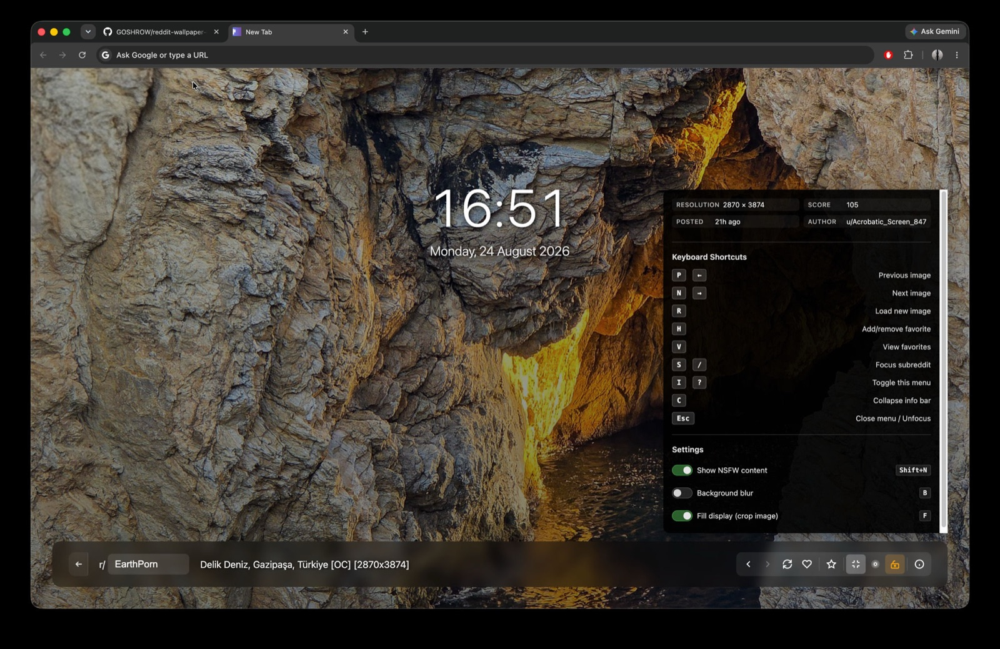
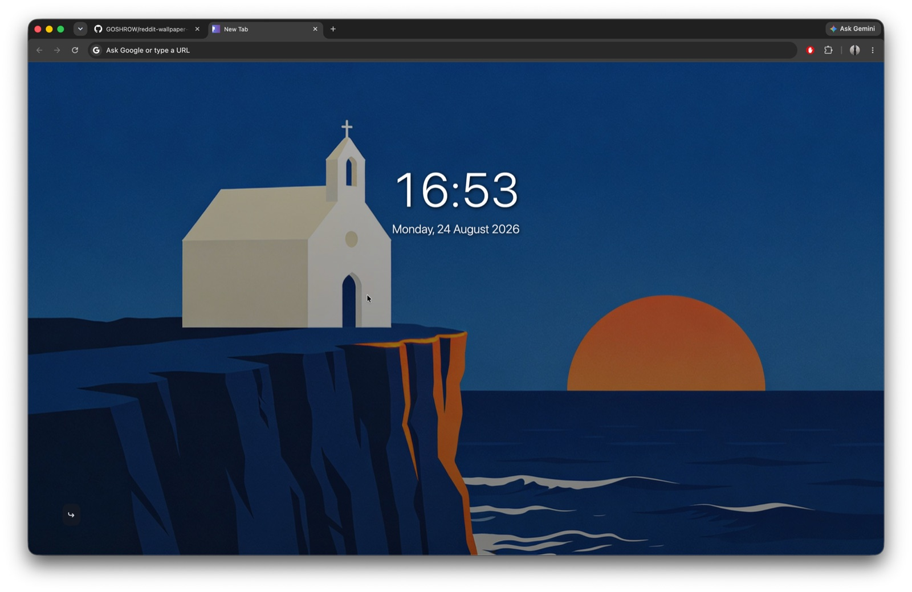

# Reddit Wallpaper New Tab

A browser extension that replaces your new tab page with stunning images from Reddit.

Works on Chrome, Firefox, Edge, Brave, Opera, and other Chromium-based browsers.


*Everything on: the info bar with subreddit, title and controls, and the panel showing image metadata alongside every shortcut*


*Collapsed with `C`: the bar folds into its own tab in the corner and the wallpaper is left alone. Every shortcut still works*

## Features

- **Beautiful wallpapers** from any subreddit (defaults to CineShots)
- **Image history** - navigate back/forward through last 50 viewed images
- **Favorites system** - save images with one click and browse them anytime
- **Smart caching** - one fetch fills the cache, then ~45 tabs open without a network call
- **Smart aspect ratio** - fill display (crops edges) or fit image (with blurred background)
- **NSFW filtering** - safe by default with optional toggle, stored per device
- **Keyboard shortcuts** - navigate efficiently without mouse
- **Draggable clock** - reposition anywhere, 12/24-hour format toggle
- **Collapsible info bar** - fold the whole bar into its own tab for an
  unobstructed wallpaper, with every shortcut still live
- **Background blur** - improve readability on busy images
- **Image info** - see resolution, score, age, and author
- **Gallery support** - extracts all images from multi-image posts
- **CDN prioritization** - loads most reliable sources first
- **Cross-browser** - works seamlessly on all major browsers

## What's new

### 1.6.0

- **Collapsible info bar.** The arrow at the left of the bar is now its own tab,
  built into the bar's left cap with a hairline seam. Clicking it (or pressing `C`)
  folds the whole bar away into that tab, leaving the wallpaper and the clock alone.
  The tab occupies the same pixels in both states, so you can fold and unfold
  without moving the mouse.
- The arrow points left, the way the bar folds, and becomes a curled arrow when
  collapsed. Neither shape is a bare chevron, so it never reads as previous/next.
- Every keyboard shortcut keeps working while collapsed. `S` and `I`, whose targets
  live inside the bar, expand it first. Errors still surface rather than being
  swallowed by the folded bar.
- The collapsed state persists across tabs and sessions.
- **Fixed:** the info panel showed a permanent scrollbar. Its `overflow` was on the
  panel itself, which both clipped the pointer arrow and left the panel 8px
  scrollable at every window size. The inner content scrolls now, and only on
  windows short enough to actually need it.
- **Fixed:** on narrow viewports two style overrides were silently losing on source
  order, so the stacked rows were centre-aligned instead of left-aligned. The
  narrow-viewport block now sits last in the stylesheet, where it belongs.
- Added browser-measured tests for geometry and animation, since the earlier
  scripted-DOM tests could not see either.

### 1.5.0

A correctness and accessibility release. No new features; a lot of things that
looked like they worked now actually do.

- **Fetches actually succeed again.** Reddit now gates its `.json` endpoints behind
  a bot check. The request is cross-origin (`chrome-extension://` → `reddit.com`),
  and a cross-origin `fetch` sends no cookies by default, so every request was
  getting a challenge page instead of data. `credentials: 'include'` — permitted by
  the existing reddit.com `host_permissions` — reuses the Reddit session your
  browser already has, which keeps setup at zero: no API key, no OAuth app, no login
  screen. See [Privacy & Security](#privacy--security) for the trade-off.
- **Reddit errors are diagnosed properly.** A 403 with an HTML body no longer claims
  your public subreddit is private, and a non-JSON response no longer leaks
  `... is not valid JSON` into the UI. HTTP 429 and 401 now have their own messages,
  and the challenge case tells you how to clear it instead of blaming your network.
- **The crossfade is real.** The outgoing image used to be erased in the same frame
  as the fade began, so every image change was a flash to dark grey.
- **The contrast scrim now renders.** It was painting underneath the wallpaper
  layers and was completely invisible, leaving the clock hard to read on bright
  images.
- **The hidden settings panel is out of the tab order.** It was reachable by
  <kbd>Tab</kbd> while invisible, so a keyboard user could switch on NSFW content
  without seeing anything happen.
- **Browser shortcuts work again.** <kbd>Cmd/Ctrl</kbd> combinations are no longer
  swallowed: <kbd>Cmd+F</kbd> was toggling display mode instead of opening find.
- **The clock can't be lost.** Its position is clamped to the viewport and stored
  per device, so dragging it on a large monitor no longer hides it on a laptop.
- **Every control has a visible focus ring** (previously only the refresh button).
- **Preloading warms the right images.** It was preloading the images shown *last*
  and skipping the ones shown next.
- **A stalled image can't wedge the tab.** A 15s watchdog releases the loader if a
  CDN socket hangs without erroring.
- **History no longer lies.** The pointer advances only once an image is actually
  on screen, so a dead URL doesn't silently skip an entry.
- **The subreddit box accepts what people paste** - `r/EarthPorn`, a full Reddit
  URL, or a URL with a query string - and rejects junk instead of building a
  broken request.
- Un-favoriting the image you are looking at no longer scrambles the carousel.
- Pressing <kbd>V</kbd> with no favorites no longer replaces your wallpaper.
- Added a test suite (`npm test`) and a packaging script (`./build.sh`).

## Installation

### Chrome / Edge / Brave / Chromium-based browsers

1. Open `about://extensions/` (`edge://extensions/` in Edge)
2. Turn on "Developer mode" (top-right toggle)
3. Click "Load unpacked" and select this folder
4. Open a new tab

### Firefox

1. Run `./build.sh` and use `dist/reddit-wallpaper-firefox-<version>.zip`, or
   rename `manifest_firefox.json` to `manifest.json` manually
2. Open `about:debugging#/runtime/this-firefox`
3. Click "Load Temporary Add-on"
4. Select the zip (or the `manifest.json`)

**Note**: Firefox requires signing through Mozilla Add-ons for permanent installation.

### Packaging for the stores

```bash
./build.sh
```

Writes `dist/reddit-wallpaper-chrome-<version>.zip` and
`dist/reddit-wallpaper-firefox-<version>.zip`. The script renames the Firefox
manifest for you, verifies both manifests carry the same version, and excludes the
README screenshots - so the shipped package is ~30 KB rather than the ~13.5 MB the
source folder weighs.

## Usage

### Basic Controls

- **Navigate images**: Use back/forward buttons (← →) or keyboard shortcuts
- **Change subreddit**: Click name at bottom left, type new name, press Enter
- **View post**: Click image title to open Reddit post
- **Load new image**: Click refresh button (↻) or press `R`
- **Shuffle favorites**: In favorites mode, refresh button (🔀) shuffles to random favorite
- **Save favorites**: Click heart (♥) or press `H` to save current image
- **View favorites**: Click star (⭐) or press `V` to browse saved images
- **Reposition clock**: Drag to move, double-click to reset
- **Toggle time format**: Click time to switch 12/24-hour format

### Keyboard Shortcuts

| Key | Action |
|-----|--------|
| `P` or `←` | Previous image in history |
| `N` or `→` | Next image in history (or load new if at end) |
| `R` | Load new image (Reddit) / Shuffle (Favorites) |
| `H` | Add/remove current image to favorites |
| `V` | Toggle favorites view / Back to Reddit |
| `S` or `/` | Focus subreddit input |
| `I` or `?` | Toggle info & shortcuts menu |
| `C` | Collapse / expand the info bar |
| `B` | Toggle background blur |
| `F` | Toggle display mode (fill/fit) |
| `Shift+N` | Toggle NSFW filter |
| `Esc` | Close menu / Unfocus input |

Shortcuts are ignored while the subreddit box is focused, and any combination
involving <kbd>Ctrl</kbd>, <kbd>Cmd</kbd> or <kbd>Alt</kbd> is left to the browser.

### Image History

- **Navigate backward**: Press `P` or `←` to view previous images
- **Navigate forward**: Press `N` or `→` to move through history
- **Capacity**: Stores last 50 viewed images
- **Persistent**: History is kept across tabs and browser sessions
- **Smart boundaries**: The back button is disabled at the oldest entry; forward at
  the newest loads a brand new image
- **NSFW filtering**: Skips NSFW images in history when the filter is enabled
- **Committed on display**: The pointer only moves once an image has actually
  rendered, so an expired URL never silently skips an entry
- **Refresh vs Navigate**: `R` loads a new image rather than walking history
- **Throttling**: 400ms cooldown between navigations with visual feedback
- **Favorites excluded**: Carousel navigation doesn't pollute Reddit history
- **Cleared on subreddit change**: Switching subreddits resets history and cache

### Favorites System

- **Save images**: Press `H` or click heart button to save current image
- **View collection**: Press `V` or click star button to enter favorites mode
- **Carousel navigation**: Use `P`/`←` and `N`/`→` for circular browsing
- **Shuffle**: Press `R` or click shuffle button (🔀) to jump to random favorite
- **Remove**: Press `H` while viewing a favorited image to remove it - the carousel
  keeps its place and lands on the correct neighbour
- **Capacity**: Up to 500 favorites (count shown in button tooltip)
- **NSFW filtering**: Applies to favorites - NSFW favorites hidden when filter is on
- **Data freshness**: Score from save time, age/author always current
- **Persistent storage**: Favorites saved permanently until manually removed
- **Independent system**: Carousel doesn't affect Reddit history

### NSFW Filtering

- **Default**: Filtered (🔒 locked icon)
- **Enabled**: Allowed (🔓 unlocked icon, orange highlight)
- **Smart clearing**: Re-enabling the filter hides a displayed NSFW image and
  immediately loads a safe replacement
- **Persistent**: Setting saved across sessions, on this device only

### Blur Toggle

- Click the blur icon to toggle a subtle blur on the background
- Improves text readability on busy images
- Setting persists across sessions

### Display Mode

- **Fill** (default): Fills viewport by cropping image edges - traditional wallpaper style
- **Fit**: Shows full image with blurred background filling letterbox areas - artistic effect
- Click display mode button or press `F` to switch
- Fill works best for landscapes, Fit preserves portraits and unusual aspect ratios
- Setting persists across sessions

### Collapsing the Info Bar

The arrow at the left end of the bar sits in its own tab, built into the bar's left
cap: same glass surface, a hairline seam where it meets the content, rounded only on
the outer edge. Click it or press `C` and the bar folds away into that tab, leaving
nothing but the wallpaper and the clock.

The arrow points left, the direction the bar actually folds; collapsed, it becomes a
curled arrow meaning "unfurl this again". Neither shape is a bare chevron, so it
never reads as the previous/next buttons beside it. The tab occupies the exact same
pixels in both states, so you can fold and unfold without moving the mouse.

Nothing stops working while it is collapsed. `N`/`P` still navigate, `R` still loads
a new image, `H` still saves a favorite, and `B`/`F`/`Shift+N` still flip their
settings; the icons just catch up when you expand again. The two shortcuts that
need the bar on screen - `S` for the subreddit box and `I` for the info panel -
expand it for you first. Errors still surface while collapsed rather than being
swallowed.

The state persists across tabs and sessions.

### Recommended Subreddits

- `CineShots` - Movie screenshots
- `EarthPorn` - Nature photography
- `wallpapers` - Curated wallpapers
- `spaceporn` - Space imagery
- `CityPorn` - Urban photography
- `ArchitecturePorn` - Architecture photos

## How It Works

### Caching Strategy

1. Fetches 50 posts at once from Reddit's public JSON API - with the browser's
   reddit.com cookies attached, which Reddit's bot check requires - and extracts
   every usable image from them (a gallery post yields several)
2. Stores URLs and metadata locally - never the images themselves
3. Serves them one per new tab by advancing an integer cursor
4. Refetches when fewer than 5 remain, when the subreddit changes, or when the
   cache is older than 30 minutes
5. Unserved images survive a refetch instead of being discarded

**Result**: the first tab makes one network request, and subsequent tabs open
without one.

Concurrent tabs claim cache slots with a token so a restored session doesn't show
the same wallpaper in every tab.

### CDN Prioritization

Images are sorted by source reliability:

1. **i.redd.it** (100) - Reddit's CDN, most reliable
2. **i.imgur.com** (90) - Imgur CDN
3. **imgur.com** (85) - Imgur direct
4. **preview.redd.it** (80) - Reddit preview
5. **external-preview.redd.it** (75) - Reddit preview of an external link
6. **External hosts** (50) - Unknown sources

Host matching is longest-prefix-first, so `external-preview.redd.it` is scored on
its own tier rather than falling into the `preview.redd.it` one. Within each tier
images are shuffled (Fisher-Yates, then a stable sort) so ordering varies between
sessions.

### Smart Loading

- **Preloading**: warms the next couple of images in the queue during idle time
- **In-page throttling**: 400ms cooldown prevents rapid UI switches
- **Cross-tab throttling**: 1-second global API rate limit across all tabs, with the
  next slot claimed before sleeping so two tabs can't both fire at once
- **Format validation**: Blocks GIFs and videos (only .jpg, .jpeg, .png, .webp)
- **Auto-retry**: up to 3 retries after the first failure (4 attempts total)
- **Load watchdog**: a load that neither succeeds nor errors within 15s is abandoned
  so the UI can't get stuck
- **Visual feedback**: Spinner shows loading state, owned by a single code path
- **Smart error detection**: single-pass filtering distinguishes missing images from
  NSFW-only content, and separates "Reddit is blocking this network" from
  "this subreddit is private"

### Image Extraction

Supports multiple Reddit post formats:
- Direct image links (imgur, external hosts)
- Reddit-hosted images (i.redd.it)
- Gallery posts (extracts all images with position labels)
- Preview images from Reddit's preview system

## Technical Details

### Architecture

**Modular design** with clean separation:
- `Logger` - Structured logging, gated to warnings and errors in a shipped build
- `Storage` - Browser storage abstraction (sync/local) with non-throwing writes
- `Prefs` - Preferences hydrated once per page load into memory, with the
  sync/local split and the v1.4 migration
- `ImageHistory` / `Favorites` - Persistent user state
- `ImageExtractor` - Multi-format image extraction
- `RedditAPI` - API calls, input normalisation and post filtering
- `ImageCache` - Caching, cursor management and preloading
- `UI` - DOM manipulation and event handling
- `App` - Main application controller with view modes

**Key technologies**:
- Vanilla JavaScript (no dependencies)
- Manifest V3 (Chrome), V2 (Firefox)
- Reddit's public JSON API
- Browser Storage API
- CSS Glassmorphism & Backdrop Filters

### Performance

- **Two storage reads at startup** - all preferences are hydrated in one batched
  read per area, then served from memory
- **Integer cursor** - serving an image writes ~20 bytes instead of re-serialising
  the whole 50-entry cache (~20 KB) on every new tab
- **Dual-layer throttling**: In-page (400ms) + cross-tab (1000ms)
- **Single-pass filtering**: image detection counts all images in one iteration
- **Efficient caching**: ~15-20KB storage for 50 image URLs
- **Minute-aligned clock**: 1,440 timer wakeups a day rather than 86,400, and it
  can't drift off the minute boundary
- **Browser-managed images**: ~5-10MB temporary memory

### Accessibility

- Semantic HTML with ARIA labels, `aria-pressed` on every toggle and
  `aria-expanded` on the info panel
- Full keyboard navigation, with a visible `:focus-visible` ring on every control
- The hidden info panel is removed from the tab order and the accessibility tree
- Respects `prefers-reduced-motion` (including stopping looping spinners)
- Enhanced borders and contrast for `prefers-contrast: high`
- Touch targets are 36x36px

Accessibility is taken seriously here but has not been formally audited - if you
find a barrier, please open an issue.

### User Interface

**Design system**:
- Glassmorphism with backdrop blur
- 600ms crossfade transitions between wallpapers
- Responsive layout (mobile/desktop)
- Fluid typography with `clamp()`

**Interactive elements**:
- Navigation buttons (back/forward/refresh) with context-aware spinners
- Blur toggle, NSFW toggle (🔒/🔓), display-mode toggle
- Info tooltip (persistent, shows image metadata)
- Draggable clock with double-click reset
- Non-blocking error notifications (dismissible, don't obscure post links)

### Storage

**Sync Storage** (roams with your browser profile) - cosmetic only:
- Clock format (12/24 hour)
- Background blur setting
- Display mode (fill/fit)
- Tooltip visibility
- Info bar collapsed state

**Local Storage** (this device only):
- Subreddit preference
- NSFW setting
- Clock position (stored as viewport fractions)
- Image cache URLs and cursor
- Image history (last 50 viewed images)
- Favorites collection (up to 500 images)
- Image metadata (author, score, age)

The subreddit name and the NSFW opt-in are deliberately **not** synced: an
adult-content preference should not follow your profile onto a shared or work
machine. Values written by v1.4 or earlier are migrated down to local storage
automatically on first run and removed from sync.

### Privacy & Security

Two kinds of host get contacted and nothing else: reddit.com for the post listing,
and whichever CDN serves each image (i.redd.it, imgur, or the site an external post
links to). There is no backend, no analytics, no telemetry.

**It rides on the Reddit session your browser already has.** Requests carry your
reddit.com cookies (`credentials: 'include'`). Reddit gates its `.json` endpoints
behind a bot check, so a cookie-less request gets a challenge page instead of data —
and reusing the session you already have is both the fix and the reason there is
nothing to set up. No API key, no OAuth app to register, no client secret shipped
inside the extension, no login screen. Install it and open a tab. Staying signed in
to Reddit is also what keeps the bot check quiet.

The trade is that those requests look like you. If you are signed in they are
attributable to your account, and your Reddit content settings can affect what comes
back alongside this extension's own NSFW toggle. The extension itself never reads,
stores or forwards a credential — the browser attaches the cookies, and they go
nowhere except reddit.com.

Everything else:

- Only cosmetic settings sync to your browser account. The subreddit, the NSFW
  toggle, favorites and history stay on the device.
- CSP is `script-src 'self'` with no inline script.
- Post titles render as text nodes, so a hostile title cannot become markup.

## Development

No dependencies and no build step for development - load the folder unpacked.

### Tests

```bash
npm test          # or: node --test tests/
```

The suite runs on Node's built-in test runner with **zero npm dependencies**, in two
tiers.

Most tests load the real `newtab.html` and `newtab.js` into a small scripted DOM with
stubbed `chrome.storage`, a scriptable `fetch`, and an `Image` implementation that
only resolves when a test says so - so image loads, stalls and failures are all
deterministic.

`tests/visual.test.js` drives a real headless Chrome over the DevTools Protocol
(using Node's built-in `WebSocket`, so still no packages) and measures actual
geometry. That tier exists because the scripted DOM has no layout engine: it can
prove a class was toggled, but not that a control stayed where it was or that a
transition interpolates. Those tests skip themselves when no Chrome binary is
present, so `npm test` still passes on a machine without one. Point `CHROME_PATH` at
a binary if it is somewhere unusual.

| File | Covers |
|------|--------|
| `tests/extractor.test.js` | image extraction, format rules, CDN tiers |
| `tests/reddit-api.test.js` | subreddit normalisation, error mapping, throttle |
| `tests/cache.test.js` | cursor, TTL, refetch merging, preload targets |
| `tests/history.test.js` | index arithmetic, NSFW skipping, trimming |
| `tests/favorites.test.js` | add/remove, carousel consistency, limits |
| `tests/ui-load.test.js` | crossfade, watchdog, retries, commit-on-display, XSS |
| `tests/keyboard.test.js` | every shortcut, modifier and auto-repeat guards |
| `tests/prefs.test.js` | sync/local split, v1.4 migration, quota failures, clock |
| `tests/subreddit.test.js` | input normalisation, destructive-clear guards, NSFW reload |
| `tests/collapse.test.js` | collapse state, persistence, shortcuts while folded |
| `tests/visual.test.js` | geometry and animation, measured in a real browser |
| `tests/static-audit.test.js` | cross-file drift between JS, HTML, CSS, manifests, README |

`static-audit.test.js` earns its keep. Most defects in this codebase have been
*drift*, not logic errors: an id the JS queries that the HTML dropped, a `hidden`
class with no rule behind it, a README shortcut that no longer exists, a version
bumped in one manifest but not the other. It asserts those invariants directly, so
they break CI instead of someone's new tab.

## Troubleshooting

**No images showing?**
- Check internet connection
- Verify subreddit name (`r/` prefixes and pasted Reddit URLs are accepted)
- Try default subreddit: "CineShots"

**"Reddit needs to verify your browser"?**
- Reddit puts its `.json` endpoints behind a bot check. Open `reddit.com` in a normal
  tab, complete any "Prove your humanity" check it shows, then come back and press
  `R`. That leaves behind the cookies the extension's request needs.
- Signing in to Reddit is the most reliable way to keep that check satisfied.
- If a public subreddit shows this repeatedly even after passing the check, your
  network's IP may also be rate-limited - try again later or from another network.

**"Reddit is rate-limiting requests"?**
- Wait a minute. The extension throttles itself to one request per second across
  all tabs, but Reddit applies its own limits per IP.

**Extension not working?**
- Enable in `chrome://extensions/`
- Click reload button on extension card
- Check browser console (F12) for errors - set `Logger.level = 'debug'` in the
  console for verbose output

**Slow loading?**
- External hosts may be slower (expected behavior)
- Extension auto-prioritizes reliable CDNs
- The next couple of images are preloaded during idle time

## Files

- `manifest.json` - Chrome/Chromium configuration (MV3)
- `manifest_firefox.json` - Firefox configuration (MV2)
- `newtab.html` - New tab page structure
- `newtab.js` - Main application logic
- `resources/styles.css` - Styling and animations
- `resources/icon*.png` - Extension icons
- `resources/screenshot*.jpg` - README assets (excluded from the packaged extension)
- `build.sh` - Produces the Chrome and Firefox zips
- `tests/` - Test suite (no dependencies)
- `LICENSE` - MIT

## License

[MIT](LICENSE) © GOSHROW
