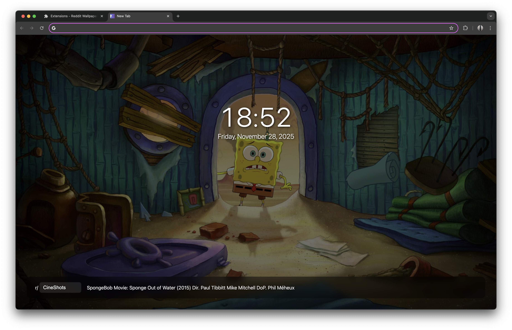

# Reddit Wallpaper Extension

A Chrome extension that replaces your new tab page with images from Reddit.

## Installation

1. Open `chrome://extensions/` in Chrome
2. Turn on "Developer mode" (top-right toggle)
3. Click "Load unpacked" and select this folder
4. Open a new tab

## Usage

The extension shows a different image each time you open a new tab.

**Change the subreddit:**
- Click on the subreddit name at the bottom left (defaults to "CineShots")
- Type a new subreddit name
- Press Enter

**View the Reddit post:**
- Click on the image title at the bottom to open the original Reddit post in a new tab

**Good subreddits to try:**
- CineShots (movie screenshots)
- EarthPorn (nature photos)
- aww
- wallpapers
- spaceporn
- CityPorn
- ArchitecturePorn

## How it works

The extension fetches 50 images at a time from Reddit and caches them locally. This means:
- Your first tab might take a second to load
- The next 45+ tabs load instantly
- No rate limiting issues
- Minimal API calls

When the cache runs low (< 5 images), it automatically fetches another batch.

### Smart Image Loading

The extension includes intelligent retry logic:
- If an image fails to load (broken URL, CORS issue, deleted content), it automatically tries the next image
- Up to 3 automatic retries to handle transient failures
- Prevents infinite loops by using different images from the cache
- Only shows an error if multiple consecutive images fail

### Image Extraction

The extension can extract images from multiple Reddit post formats:
- Direct image links (imgur, external hosts)
- Reddit-hosted images (i.redd.it)
- Gallery posts (uses first image)
- Preview images from Reddit's preview system

Images are shuffled randomly for variety each time the cache is refreshed.

## Troubleshooting

**No images showing up?**
- Check your internet connection
- Make sure the subreddit name is correct (no "r/" prefix)
- Try a different subreddit like "CineShots"

**Extension not working?**
- Make sure it's enabled in `chrome://extensions/`
- Click the reload button on the extension card
- Check the browser console (F12) for errors

## Technical details

### Architecture

- **Modular Design**: Code organized into logical modules (Storage, Settings, ImageExtractor, RedditAPI, ImageCache, UI, App)
- **Caching Strategy**: Batch fetching (50 images) with automatic refill when cache drops below 5 images
- **Error Handling**: Automatic retry mechanism with up to 3 attempts for failed image loads
- **State Management**: Uses Chrome Storage API (sync for settings, local for cache)

### Technologies

- Built with vanilla JavaScript (no frameworks or dependencies)
- Chrome Extension Manifest V3
- Uses Reddit's public JSON API (no authentication required)
- Chrome Storage API for persistent data
- Fisher-Yates shuffle algorithm for randomization

### Data Flow

1. **Initialization**: Load saved subreddit preference from sync storage
2. **Cache Check**: Check if cache exists and has sufficient images (≥5)
3. **API Fetch**: If needed, fetch 50 posts from Reddit's `/r/{subreddit}/new.json` endpoint
4. **Filter & Extract**: Filter image posts and extract URLs from various post formats
5. **Shuffle & Cache**: Randomize order and store in local storage
6. **Display**: Load next image from cache with automatic retry on failure
7. **Refill**: When cache drops below 5, automatically fetch next batch

### Key Features

- **Image Format Support**: Direct links, Reddit-hosted (i.redd.it), galleries, previews
- **Smart Filtering**: Automatically identifies and filters image-containing posts
- **Efficient Caching**: Minimizes API calls while ensuring fresh content
- **Retry Logic**: Automatically skips broken/failed images (up to 3 attempts)
- **Responsive UI**: Adaptive layout for mobile and desktop
- **Accessibility**: ARIA labels, semantic HTML, keyboard navigation support
- **Performance**: Preloading with Image() constructor, CSS transitions with will-change

### Storage

- **Sync Storage**: User preferences (subreddit name)
- **Local Storage**: Image cache (URLs, titles, permalinks), cache metadata (subreddit, timestamp)

### Privacy & Security

- No tracking or analytics
- No external servers (except Reddit's public API)
- Content Security Policy enforced
- No data collection or transmission
- All data stored locally in browser

## Files

- `manifest.json` - Extension configuration and permissions
- `newtab.html` - New tab page structure
- `newtab.js` - Main application logic (modular architecture)
- `styles.css` - Responsive styles with accessibility features
- `icon*.png` - Extension icons (16x16, 48x48, 128x128)
- `README.md` - Documentation

## Privacy

This extension:
- Doesn't collect any data
- Doesn't send anything to external servers
- Only fetches images from Reddit's public API
- Stores your subreddit preference locally

## License

MIT
